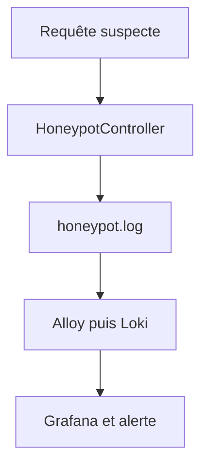

# Honeypot de CesiZen

## Objectif

Le honeypot de CesiZen expose plusieurs fausses routes fréquemment recherchées par les robots et les outils automatisés malveillants.

Ces routes ne donnent accès à aucune fonctionnalité réelle. Lorsqu’une route est appelée, l’événement est enregistré puis l’API renvoie volontairement une réponse `404 Not Found`.

Le dispositif permet donc de détecter une activité suspecte sans exposer de données sensibles.

## Routes surveillées

Le contrôleur `HoneypotController` déclare quatre pièges :

| Route | Méthodes | Identifiant du piège | Cible simulée |
|---|---|---|---|
| `/wp-login.php` | GET et POST | `wp_login` | page de connexion WordPress |
| `/phpmyadmin` | GET et POST | `phpmyadmin` | interface phpMyAdmin |
| `/.env` | GET | `env` | fichier de variables sensibles |
| `/.git/config` | GET | `git_config` | configuration interne de Git |

Toutes ces routes renvoient un corps vide avec le statut HTTP `404`.

## Fonctionnement général



### 1. Réception de la requête

Symfony associe la fausse route au `HoneypotController`. Le contrôleur transmet la requête et l’identifiant du piège au service `HoneypotLogger`.

### 2. Écriture du journal

Le service écrit un message de niveau `warning` dans le canal Monolog `honeypot` :

```text
Honeypot triggered
```

Le contexte actuellement enregistré contient :

- l’identifiant du piège ;
- le chemin demandé ;
- la méthode HTTP utilisée.

Le fichier produit est :

```text
CesiZen_API/var/log/honeypot.log
```

Le corps de la requête et les éventuels identifiants envoyés ne sont pas enregistrés.

### 3. Partage du journal avec Docker

Le volume Docker `back_logs` conserve les journaux de l’API :

```yaml
back:
  volumes:
    - back_logs:/app/var/log
```

Le même volume est monté en lecture seule dans Alloy :

```yaml
alloy:
  volumes:
    - back_logs:/var/log/cesizen:ro
```

Cette configuration permet à Alloy de consulter les journaux sans pouvoir les modifier.

### 4. Collecte par Alloy

Alloy surveille le fichier suivant toutes les cinq secondes :

```text
/var/log/cesizen/honeypot.log
```

Il ajoute notamment les labels suivants :

```text
job="cesizen-honeypot"
service="api"
project="cesizen"
```

Les événements sont ensuite envoyés à Loki sur :

```text
http://loki:3100/loki/api/v1/push
```

### 5. Consultation dans Grafana

Loki est déclaré comme source de données Grafana. Le dashboard CesiZen contient une section **Sécurité — Honeypot** avec :

- le nombre de tentatives pendant les dernières 24 heures ;
- l’évolution de l’activité du honeypot ;
- la liste des dernières tentatives détectées.

Les principales requêtes LogQL utilisées sont :

```logql
sum(count_over_time({job="cesizen-honeypot"} |= "Honeypot triggered" [24h]))
```

```logql
sum(count_over_time({job="cesizen-honeypot"} |= "Honeypot triggered" [$__interval]))
```

```logql
{job="cesizen-honeypot"} |= "Honeypot triggered"
```

## Alerte Grafana

Une règle d’alerte peut utiliser le nombre d’événements du honeypot sur une période courte.

La logique configurée est la suivante :

1. Grafana interroge les événements Loki.
2. Une expression **Reduce** récupère la dernière valeur avec l’opération `Last`.
3. La condition vérifie si la valeur est supérieure à zéro.
4. La règle est évaluée toutes les 30 secondes ou toutes les minutes.
5. Le point de contact configuré peut transmettre l’alerte et créer un ticket Jira.

Une seule tentative suffit donc à déclencher la règle pendant la période observée.

## Tester le honeypot

Depuis PowerShell, appeler une route leurre :

```powershell
curl.exe -i http://localhost:8000/wp-login.php
```

Le résultat attendu est :

```text
HTTP/1.1 404 Not Found
```

Ce statut est volontaire et confirme que la fausse route ne révèle aucun contenu.

Vérifier ensuite le journal de l’API :

```powershell
docker exec cesizen-api sh -lc 'tail -n 20 var/log/honeypot.log'
```

Vérifier éventuellement la collecte Alloy :

```powershell
docker compose logs alloy --tail=50
```

Dans Grafana, la requête suivante permet d’afficher les événements :

```logql
{job="cesizen-honeypot"} |= "Honeypot triggered"
```

Il peut être nécessaire d’attendre quelques secondes, car Alloy synchronise le fichier périodiquement.

## Fichiers concernés

```text
CesiZen_API/src/Controller/HoneypotController.php
CesiZen_API/src/Security/Honeypot/HoneypotLogger.php
CesiZen_API/config/packages/monolog.yaml
monitoring/alloy/config.alloy
monitoring/loki/loki-config.yml
monitoring/grafana/dashboards/cesizen.json
monitoring/grafana/provisioning/datasources/grafana-prometheus-datasource.yml
docker-compose.yml
```

## Limites actuelles

- Le honeypot détecte seulement les routes explicitement déclarées.
- Il enregistre actuellement le piège, le chemin et la méthode, mais pas l’adresse IP ni le User-Agent.
- Il détecte une tentative sans la bloquer globalement ni bannir son auteur.
- Une route leurre connue peut être évitée par un attaquant.
- L’alerte dépend du bon fonctionnement d’Alloy, de Loki et de Grafana.

Le honeypot constitue donc une couche de détection complémentaire. Il ne remplace pas l’authentification, le contrôle des autorisations, la validation des entrées, les mises à jour de sécurité ou la supervision générale.

## Conclusion

Le honeypot de CesiZen fournit un mécanisme simple et peu intrusif pour détecter des recherches de fichiers ou d’interfaces sensibles. Les tentatives sont isolées dans un journal dédié, centralisées avec Alloy et Loki, puis rendues visibles dans Grafana afin de faciliter la surveillance et l’alerte.
